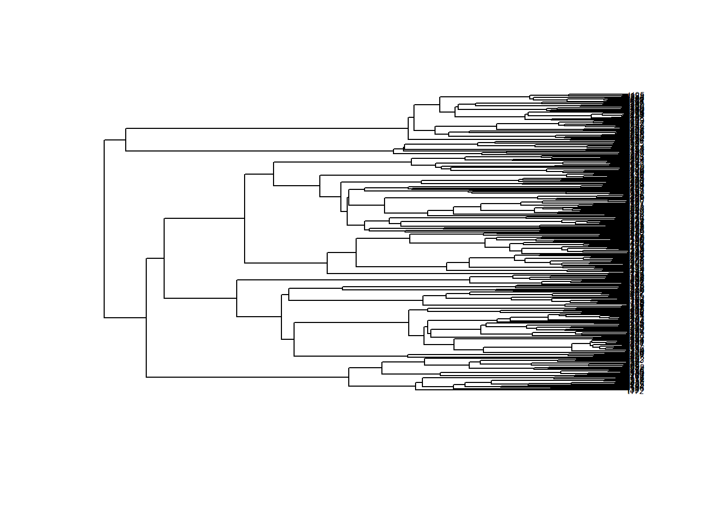
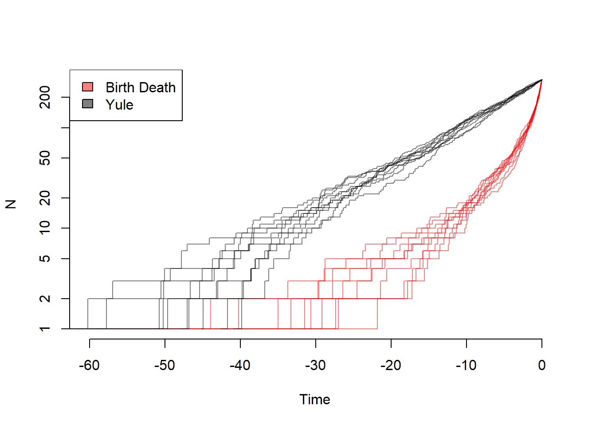

```r
library(hisse)
```

```
## Warning: package 'hisse' was built under R version 4.1.3
```

```
## Loading required package: ape
```

```
## Warning: package 'ape' was built under R version 4.1.2
```

```
## Loading required package: deSolve
```

```
## Warning: package 'deSolve' was built under R version 4.1.2
```

```
## Loading required package: GenSA
```

```
## Loading required package: subplex
```

```
## Warning: package 'subplex' was built under R version 4.1.2
```

```
## Loading required package: nloptr
```

```
## Warning: package 'nloptr' was built under R version 4.1.2
```

```r
library(ape)
library(TreeSim)
```

```
## Warning: package 'TreeSim' was built under R version 4.1.2
```

```
## Loading required package: geiger
```

```
## Warning: package 'geiger' was built under R version 4.1.3
```

```r
library(geiger)
library(diversitree)
```

```
## Warning: package 'diversitree' was built under R version 4.1.2
```


```r
my.tree <- TreeSim::sim.bd.taxa(n=300, numbsim=1, lambda=0.1, mu=0)[[1]]
plot.phylo(my.tree,cex = 0.5)
```



```r
ape::ltt.plot(my.tree)
```


```r
ape::ltt.plot(my.tree, log = "y")
```


```r
yule.trees <- TreeSim::sim.bd.taxa(n=300, numbsim=10, lambda=0.1, mu=0, complete=FALSE)
mult.trees <- mltt.plot(yule.trees, log = "y")
```


```r
bd.trees <- TreeSim::sim.bd.taxa(n=300, numbsim=10, lambda=1, mu=.9, complete=FALSE)
ape::mltt.plot(bd.trees, log="y", legend=FALSE)
```


```r
depth.range <- range(unlist(lapply(yule.trees,ape::branching.times)), unlist(lapply(bd.trees,ape::branching.times)))
max.depth <- sum(abs(depth.range)) #ape rescales depths
plot(x=c(0, -1*max.depth), y=c(1, ape::Ntip(yule.trees[[1]])), log="y", type="n", bty="n", xlab="Time", ylab="N")
colors=c(rgb(1,0,0,0.5), rgb(0, 0, 0, 0.5))
list.of.both <- list(bd.trees, yule.trees)
for (i in sequence(2)) {
    tree.list <- list.of.both[[i]]
    for (j in sequence(length(tree.list))) {
        ape::ltt.lines(tree.list[[j]], col=colors[[i]])
    }
}
legend("topleft", legend=c("Birth Death", "Yule"), fill=colors)
```




```r
depth.range <- range(unlist(lapply(yule.trees,ape::branching.times)), unlist(lapply(bd.trees,ape::branching.times)))
max.depth <- sum(abs(depth.range)) #ape rescales depths
plot(x=c(0, -5), y=c(200, ape::Ntip(yule.trees[[1]])), log="y", type="n", bty="n", xlab="Time", ylab="N")
colors=c(rgb(1,0,0,0.5), rgb(0, 0, 0, 0.5))
list.of.both <- list(bd.trees, yule.trees)
for (i in sequence(2)) {
    tree.list <- list.of.both[[i]]
    for (j in sequence(length(tree.list))) {
        ape::ltt.lines(tree.list[[j]], col=colors[[i]])
    }
}
legend("topleft", legend=c("Birth Death", "Yule"), fill=colors)
```


